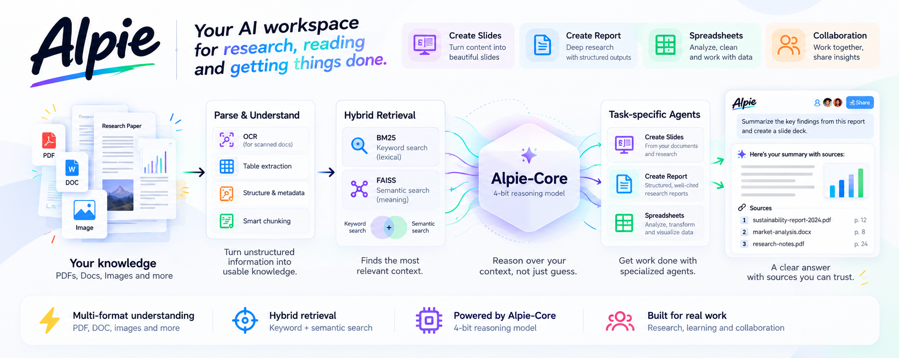

# 👋 Hey, you found us!

We're **169pi** — building open reasoning models out of India.
This is our org profile; the good stuff lives across our repos and model hubs.

  
  
  
  
  
  

---

## 🧠 Alpie-Core

Our first-generation reasoning model — **32B params, 4-bit**, Apache 2.0.

| GSM8K      | MMLU       | SWE-Bench Verified | Context Length | VRAM   |
| ---------- | ---------- | ------------------ | -------------- | ------ |
| **92.75%** | **81.28%** | **57.8%**          | 65K            | ~16 GB |

---

## From Knowledge to Work

> **What if your AI could actually work with the things you work with?**

A research paper. A bunch of PDFs. A spreadsheet. A question that needs some digging.

That's what we built Alpie for.

Alpie is an AI workspace built around **Alpie-Core**. You can bring in your documents, ask questions, do research, and turn what you find into something useful without jumping between different tools.

### More than just chat

You can use Alpie to:

- 📊 **Work with spreadsheets** and analyze your data
- 📑 **Create reports** from your research and documents
- 🎞️ **Create slides** from the work you've already done
- 🤝 **Collaborate** and share your work with others

The idea is pretty simple. Instead of starting from a blank chat, start with the information you already have and build from there.

### Try it yourself

**Bring a document. Ask a question. Start researching. Turn the result into something useful.**

[**→ Try Alpie**](https://alpie.ai/)

---

_Built at 169Pi, open reasoning tools from India for the world._
