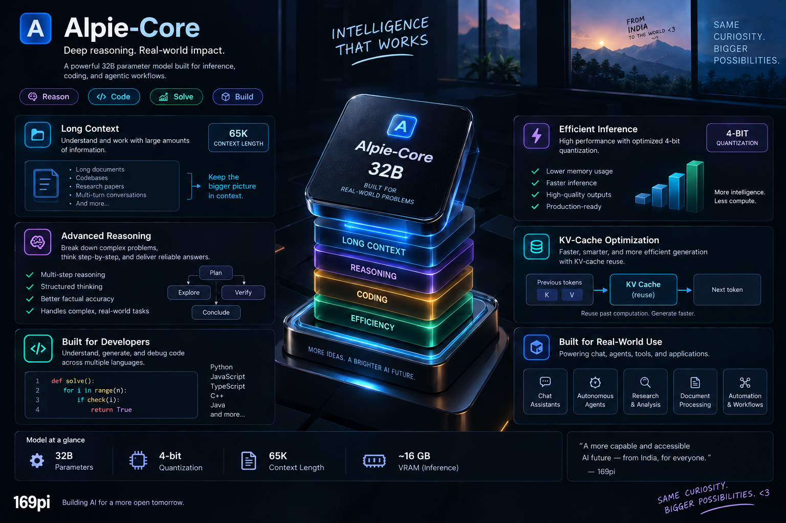

# 👋 Hey, you found us!

We're **169pi** — building open reasoning models out of India.
This is our org profile; the good stuff lives across our repos and model hubs.

  
  
  
  
  
  

---

## 🧠 Alpie-Core

Our first-generation reasoning model — **32B params, 4-bit**, Apache 2.0.

| GSM8K | MMLU | SWE-Bench Verified | Context Length | VRAM |
|---|---|---|---|---|
| **92.75%** | **81.28%** | **57.8%** | 65K | ~16 GB |

---

## 🎨 Make this README yours

### [@parshurambagade](https://github.com/parshurambagade) — Alpie-Core Capabilities

*An overview of Alpie-Core's capabilities, including advanced reasoning, code generation, long-context understanding, efficient inference, KV-cache optimization, and real-world applications.*

---

  Made with curiosity by the <strong>169pi</strong> team

